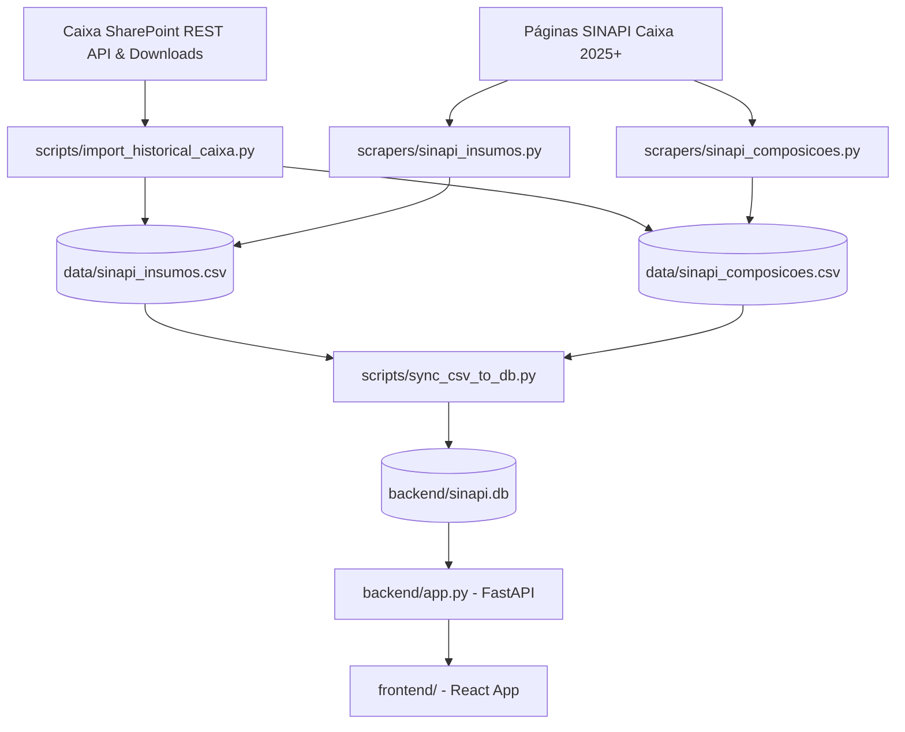

# PulseSINAPI

**Inteligência em Custos da Construção Civil** — dados do SINAPI (Caixa Econômica Federal) coletados, estruturados, normalizados e entregues para uso institucional.

🚀 **Acesse a aplicação em Produção no Google Cloud Run:** [https://pulsesinapi-343139607879.southamerica-east1.run.app/](https://pulsesinapi-343139607879.southamerica-east1.run.app/)

[](https://github.com/PulseDataLabs/PulseSINAPI/actions/workflows/main.yml)

---

## O problema

O SINAPI (Sistema Nacional de Pesquisa de Custos e Índices da Construção Civil) é o principal referencial para orçamentos de obras públicas e privadas no Brasil. No entanto, o consumo de seus dados apresenta sérios desafios técnicos:

- **Arquivos Fragmentados**: Os dados são disponibilizados pela Caixa Econômica Federal na forma de milhares de arquivos ZIP contendo planilhas Excel por estado (UF) e por mês.
- **Dificuldade de Consolidação**: Não há uma série histórica unificada. Comparar preços de insumos ou composições ao longo dos anos exige baixar, descompactar e ler milhares de planilhas.
- **Instabilidade de Headers**: Os layouts das planilhas variam com frequência (deslocamentos de linhas, mudanças de cabeçalhos e termos em português).
- **Limitação de Rate Limit (HTTP 403/429)**: Tentativas de download em lote diretamente dos servidores da Caixa frequentemente disparam bloqueios CDN (Azion).

O **PulseSINAPI** resolve isso através de um pipeline automatizado de extração, tratamento com resiliência a rate limit, deduplicação em base flat (CSV), e sincronização com banco relacional (SQLite), entregando bases consolidadas de insumos e composições desde **2015**.

## Posicionamento no portfólio PulseDataLabs

| Produto | Cobre | Gap |
|---------|-------|-----|
| **PulseFlat** | Macro e mercado (taxas, câmbio, fundos, índices) | Não cobre custos do setor produtivo e construção civil |
| **PulseIFData** | SFN (bancos, financeiras, inadimplência, Basileia) | Não cobre o SFN doméstico |
| **PulseSINAPI** | Custos e índices de construção civil | **Complementar** — preços de insumos (materiais e mão de obra) e composições de serviços |

## Arquitetura

```
PulseSINAPI/
├── scrapers/
│   ├── utils/
│   │   └── base.py             # BaseScraper comum do ecossistema
│   ├── sinapi_insumos.py       # Coleta e parsing de insumos mensais (preços)
│   └── sinapi_composicoes.py   # Coleta e parsing de composições de custos
├── scripts/
│   ├── import_historical_data.py  # Importador de dados históricos locais (2025-2026)
│   ├── import_historical_caixa.py # Importador histórico Caixa (SharePoint, <=2024) com contingência
│   └── sync_csv_to_db.py       # Sincronizador de alta velocidade CSV para SQLite
├── utils/base.py               # Operações flat (salvar_csv com dedup e last_updates.json)
├── backend/
│   ├── db.py                   # Banco SQLite relacional (SQLAlchemy)
│   ├── app.py                  # API REST FastAPI para buscas e simulação de orçamentos
│   └── sinapi.db               # Banco de dados SQLite unificado
├── frontend/
│   └── src/                    # Dashboard SPA em React + Vite + ECharts + Tailwind (Localhost)
├── data/
│   ├── sinapi_insumos.csv      # Base flat de insumos e preços históricos
│   ├── sinapi_composicoes.csv  # Base flat de composições e coeficientes
│   ├── last_updates.json       # Bounds temporais dos dados flat
│   └── pipeline_status.json    # Status de execução do pipeline
├── run_all.py                  # Orquestrador do pipeline flat (GitHub Actions)
├── run.py                      # Utilitário boot para backend + frontend locais
├── index.html                  # Landing page interativa (GitHub Pages)
└── consulta.html               # Explorer interativo de dados (GitHub Pages)
```

### Pipeline de Dados



## Instalação e Execução

### Requisitos
- Python 3.10+
- Node.js 18+ (para o dashboard local)

### Setup do Ambiente
```bash
# 1. Clone o repositório
git clone https://github.com/PulseDataLabs/PulseSINAPI.git
cd PulseSINAPI

# 2. Instale as dependências do pipeline
pip install -r requirements.txt
```

### Execução do Pipeline Flat
```bash
# Executar todos os scrapers configurados (2025+)
python run_all.py

# Importar referências históricas antigas do SharePoint (Caixa <=2024)
# Exemplo: Dezembro de 2023 para todos os estados brasileiros:
python scripts/import_historical_caixa.py --all-ufs --month 2023-12 --limit 50
```

### Execução do Dashboard Completo (Local)
Para rodar a interface completa com banco SQLite relacional, API FastAPI e frontend React interativo:
```bash
python run.py
```
Isso iniciará:
- O backend FastAPI em `http://localhost:8000`
- O frontend React + Vite em `http://localhost:5173`

## Datasets Disponibilizados

Os CSVs na pasta `data/` seguem o padrão: **UTF-8, separador vírgula, decimal ponto, datas YYYY-MM-DD**.

| Arquivo | Descrição | Frequência | Fonte |
|---------|-----------|------------|-------|
| [`sinapi_insumos.csv`](data/sinapi_insumos.csv) | Série histórica de preços de insumos (materiais e mão de obra) por estado, mês e desoneração. Mapeado para 8 dígitos. | Mensal | Caixa / SINAPI |
| [`sinapi_composicoes.csv`](data/sinapi_composicoes.csv) | Ficha técnica de composições de serviços (itens constituintes, coeficientes e tipos de item). | Mensal | Caixa / SINAPI |

## Licença

Dados públicos do [SINAPI / Caixa Econômica Federal](https://www.caixa.gov.br/).
Código sob licença MIT.
